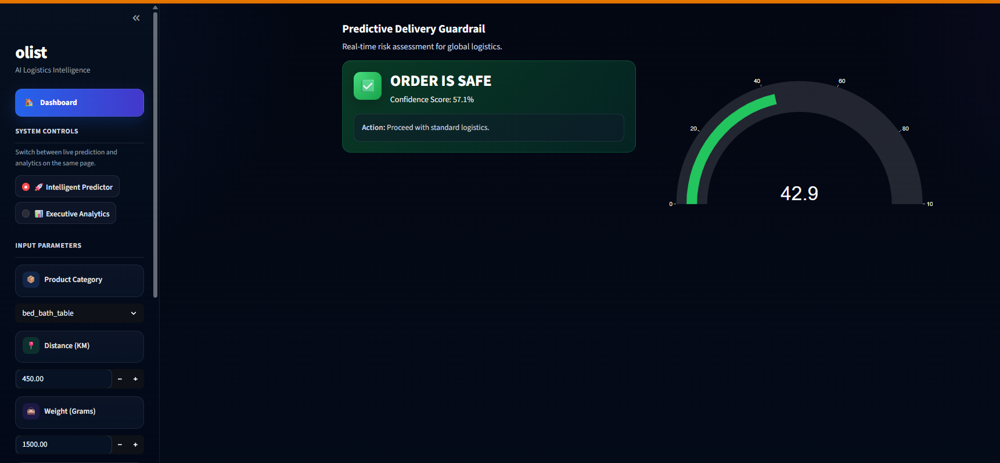
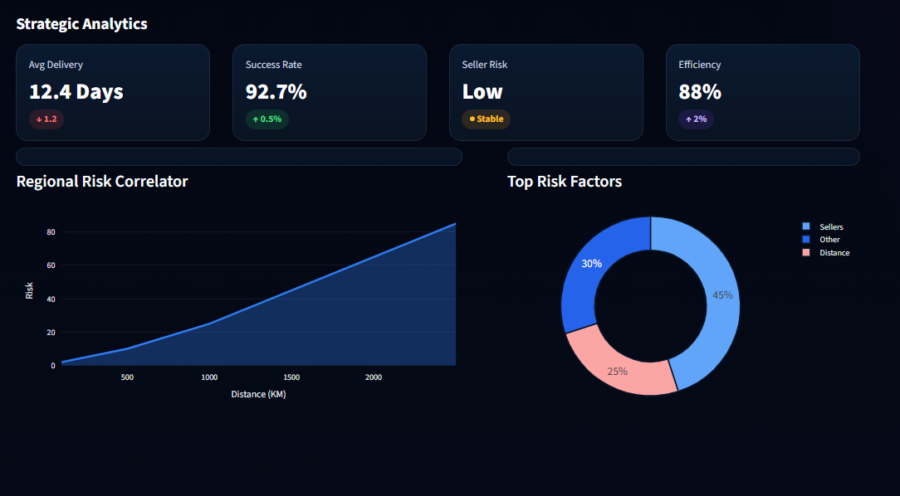
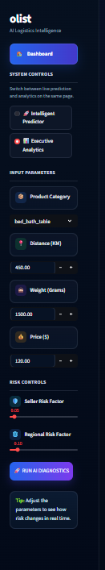

# 🚀 Olist Intelligent Guardrail (E-commerce Logistics Intelligence)

### AI-Powered Delivery Risk Prediction  
**End-to-End Data Science & Machine Learning Application**

**FastAPI · Streamlit · Scikit-learn · Plotly · Hugging Face Spaces**

---


---

## 🌍 Live Demo

👉 **[Launch App](https://huggingface.co/spaces/bringerofdarkness/olist-intelligent-guardrail)**  
*(Interactive AI dashboard with real-time prediction)*

---

## 📸 App Preview

<p align="center">
  
  
</p>

<p align="center">
  
</p>

---

## 📌 Project Overview

**Olist Intelligent Guardrail** is an end-to-end machine learning system built to predict **delivery delay risk** in e-commerce logistics.

The project combines:

* 🔍 Advanced feature engineering
* 🤖 Ensemble machine learning model
* ⚡ FastAPI backend for real-time inference
* 📊 Streamlit dashboard for business insights
* 🚀 Deployment-ready architecture for live product demonstration

This solution is designed to help e-commerce businesses proactively identify risky orders before delivery issues impact customers and operations.

---

## 🧠 Problem Statement

Late deliveries can significantly harm:

* Customer satisfaction
* Seller reliability
* Marketplace trust
* Operational efficiency

This system predicts **whether an order is likely to be delayed**, enabling:

* proactive intervention
* smarter logistics planning
* risk-aware operational decisions
* faster response to high-risk shipments

---

## ⚙️ System Architecture

```text
User Input → Streamlit UI → FastAPI API → ML Model → Prediction → Dashboard
```

---

## 🔑 Key Features

### ✅ Real-Time Prediction

* Instant delay risk scoring
* Confidence-based prediction output
* Low-risk vs high-risk classification

### 📊 Executive Analytics Dashboard

* Delivery performance indicators
* Risk factor visualization
* Regional risk correlation insights
* Interactive business-facing UI

### 🧠 ML Intelligence

* Feature-engineered inputs such as:

  * logistics stress
  * freight ratio
  * seller reliability
  * regional late-delivery patterns
* Ensemble model optimized for prediction performance

### 🎯 Business Impact

* Identify high-risk deliveries before failure
* Support logistics decision-making
* Improve customer delivery experience
* Reduce operational blind spots

---

## 📁 Project Structure

```text
olist-intelligent-guardrail/
│
├── api/                # FastAPI backend
├── frontend/           # Streamlit UI
├── models/             # Trained ML artifacts
├── data/               # Dataset files
├── notebooks/          # EDA & feature engineering
├── src/                # Core project modules
├── tests/              # Testing scripts
├── Dockerfile
└── README.md
```

---

## 🛠️ Tech Stack

| Layer         | Technology          |
| ------------- | ------------------- |
| ML Model      | Scikit-learn        |
| Backend       | FastAPI             |
| Frontend      | Streamlit           |
| Visualization | Plotly              |
| Deployment    | Hugging Face Spaces |

---

## 📊 Model Details

* **Model Type:** Robust Ensemble Classifier
* **Primary Inputs:**

  * Distance
  * Price
  * Weight
  * Seller Risk
  * Regional Risk
* **Outputs:**

  * Delay Probability
  * Risk Classification

---

## 📂 Dataset

This project uses the **Brazilian E-Commerce Public Dataset by Olist**.

👉 Dataset Link:
https://www.kaggle.com/datasets/olistbr/brazilian-ecommerce/code

The dataset provides rich transactional and logistics information that supports:

* delivery behavior analysis
* seller performance analysis
* customer order flow understanding
* feature engineering for delay prediction

---

## 🔗 Repository

👉 GitHub Repository:
https://github.com/bringerofdarkness/olist-intelligent-guardrail

---

## 🚀 How to Run Locally

### 1. Clone Repository

```bash
git clone https://github.com/bringerofdarkness/olist-intelligent-guardrail.git
cd olist-intelligent-guardrail
```

### 2. Create Virtual Environment

```bash
python -m venv venv
```

### 3. Activate Virtual Environment

**Windows**

```bash
venv\Scripts\activate
```

**Mac/Linux**

```bash
source venv/bin/activate
```

### 4. Install Dependencies

```bash
pip install -r api/requirements.txt
```

### 5. Run Backend

```bash
cd api
uvicorn main:app --reload
```

### 6. Run Frontend

Open a new terminal from the project root, then run:

```bash
cd frontend
streamlit run app.py
```

---

## 📈 Future Improvements

* 🔄 Automated model retraining pipeline
* 📦 Batch prediction support
* 📊 Enhanced analytics dashboard
* ☁️ Production-grade cloud deployment
* 📉 Model monitoring and drift detection

---

## 👨‍💻 Author

**Md Shahrul Zakaria**

📧 [md.shahrul.zakaria@gmail.com](mailto:md.shahrul.zakaria@gmail.com)
🔗 LinkedIn: https://www.linkedin.com/in/md-shahrul-zakaria-24a805230/
🔗 GitHub: https://github.com/bringerofdarkness

---

## ⭐ Support

If you found this project useful, consider giving it a ⭐ on GitHub.

---
